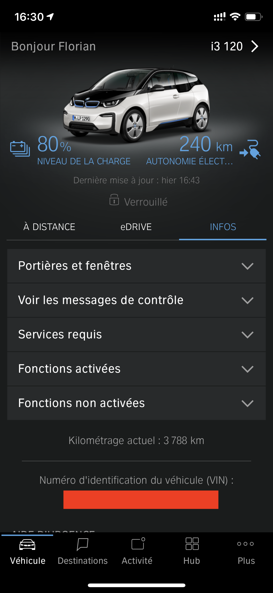

Description
===

Plugin permettant de récupérer les informations des voitures BMW équipées des services ConnectedDrive.

Voitures testées :
- I3

Si vous êtes propriétaires d'un autre véhicule BMW et souhaitez tester le fonctionnement, n'hésitez pas à me contacter.

Vous pouvez retrouver d'autres tutoriels sur mon blog : [www.ma-maison-intelligente.fr](http://www.ma-maison-intelligente.fr)

Installation
===

# Installation depuis un dépôt GitHub #
- Vous pouvez télécharger le plugin au format zip depuis le dépot [GitHub](https://github.com/flabadens/BMWConnectedDrive).
- Au préalable, dans la configuration Jeedom, il vous faudra peut être activer les sources de type fichier.
- Vous pourrez ensuite ajoutez un plugin avec le type de source Fichier. L’ID logique du plugin doit être renseigné exactement comme suit : BMWConnectedDrive.
- Puis cliquez sur le bouton "Envoyer un plugin" et sélectionnez le zip téléchargé précédemment depuis GitHub.
- Cliquez sur "Enregistrer". Le plugin est maintenant installé.

Configuration
===

- Après installation du plugin, il vous faudra l'activer. Il apparaitra ensuite dans le menu Plugins > Objets connectés.
- Vous pourrez ensuite ajouter un véhicule.
Il vous faudra renseigner 3 paramètres nécessaires au plugin et à la connection avec le service BMW ConnectedDrive:
  - VIN (Vehicle Identification Number) : Seulement les 7 derniers caractères du numéro d'identification sont disponibles sur le site BMW ConnectedDrive. Le numéro complet que vous aurez besoin ici se trouve sur le certificat d'immatriculation (carte grise, champ E) ou sur votre application mobile / infos.
  
  - Username : identifiant pour accéder au site BMW ConnectedDrive
  - Password : Mot de passe pour accéder au site BMW ConnectedDrive
- Vous pouvez une fois l'équipement sauvegardé, tester la connexion avec BMW ConnectedDrive. Vous aurez un retour brut des données potentiellement récupérables que nous pourrons utiliser pour tester les nouveaux véhicules BMW.

Commandes disponibles pour le moment
===

## Informations ##
### Global ###
- Verrouillage (doorLockState) : string
- Eclairage (lightsParking) : string
- Kilométrage (mileage) : numeric
- Unité de distance (unitOfLength) : string
- Messages du véhicule (vehicleMessages) : json
- Porte Conducteur Arrière (doorDriverRear) : string
- Porte Passager Arrière (doorPassengerRear) : string
- Porte Conducteur Avant (doorDriverFront) : string
- Porte Passager Avant (doorPassengerFront) : string
- Fenêtre Conducteur Avant (windowDriverFront) : string
- Fenêtre Passager Avant (windowPassengerFront) : string
- Coffre (trunk_state) : string
- Dernière mise à jour (lastUpdate) : string

### Electrique / Hybride ###
- Etat de la charge (chargingStatus) : string
- Etat de la prise (connectorStatus) : string
- Km restant (électrique) (beRemainingRangeElectric) : numeric
- Pourcentage restant (chargingLevelHv) : numeric

### Thermique ###
- Km restant (thermique) (beRemainingRangeFuelKm)
- Carburant restant (remaining_fuel) : numeric

## Commandes ##
- Rafraichir (refresh)
- Verrouiller
- Déverrouiller
- Klaxonner
- Appel de phares
- Climatiser

Fonctionnalités à venir
===
- Ajout d'un widget
- Ajout des mesures d'Efficience
- Ajout d'intéraction avec la voiture
- Envoi de message au véhicule

Changelog
===
[ici](https://flabadens.github.io/BMWConnectedDrive/fr_FR/)

Support
===
N'hésitez pas à me contacter sur mon blog [www.ma-maison-intelligente.fr](http://www.ma-maison-intelligente.fr) ou sur [ma page facebook](https://www.facebook.com/mamaisonintelligentefr/).
